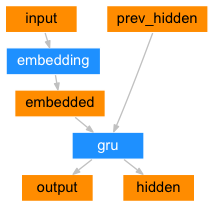

# About Data

## Where to Download Data

As is mentioned in [the tutorial](https://pytorch.org/tutorials/intermediate/seq2seq_translation_tutorial.html), all data (any other languages) are available at [https://www.manythings.org/anki/](https://www.manythings.org/anki/)

Englich-French file is necessary for this example.

Please download and unzip [data.zip](https://download.pytorch.org/tutorial/data.zip) before continuing.

## Seq2Seq Model

Recurrent Neural Network (RNN): a network that operates on a sequence and uses its own output as input for subsequent steps.

Sequence to Sequence Network (seq2seq network, or Encoder Decoder network): a model consisting of two RNNs --- the encoder, and the decoder. 
* the encoder: reads an input sequence and outputs a single vector;
* the decoder reads that vector to produce an output sequence.

Encoder Network:

Decoder Network:

Attention Decoder Network:

